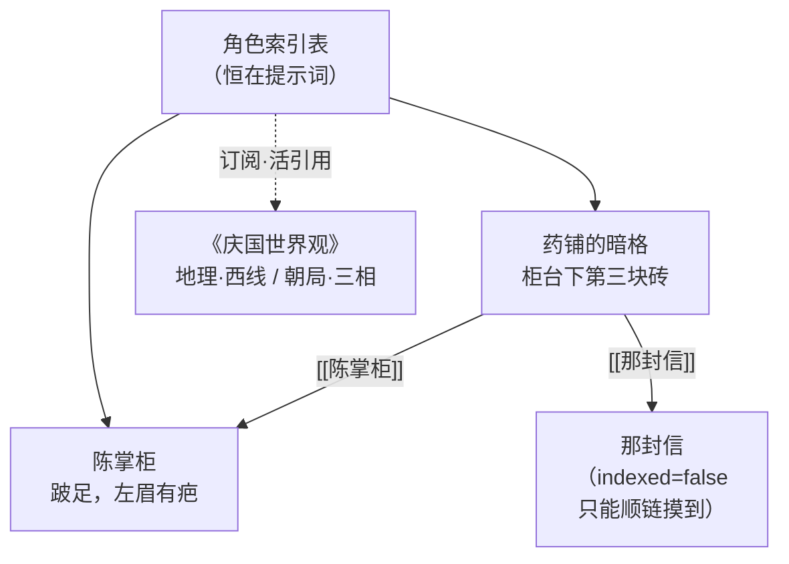

# 信息库系统 · 设计文档

> 一句话：给每个角色一个**跨场景持久、随经历增长、可追溯可回退**的知识体，让"他知道什么"从一句手写的静态声明，变成一个会呼吸的图。

本文是这一子系统的设计基准与实现依据。**已定稿**，实现按 §12 的分段推进。

---

## 一、目标与范围

### 1.1 要解决的问题

现状里"角色知道什么"由两样东西承担，都不够用：

- `CharacterCard.knowledge_boundary`：一张卡上几行手写文本，**不会长、不会更新**，且与"事实"和"约束"混在一起；
- `CharacterMemory`：**场景内**的私有记忆（state / 印象 / 可见转录），**散场即散**，从不回流到角色身上。

于是角色跨场景是不连续的：上一场他亲眼看见的东西，这一场他不记得；几十场之后，他脑子里的"阅历"还是卡上那几行。

### 1.2 本期交付

1. **信息库**：一个角色可拥有一个知识库，由**条目**构成，条目正文之间以 `[[键]]` 互链，构成图。
2. **索引表**：库的**入口**。恒在提示词里（标题 + 一行摘要），角色据此决定去读哪一条。
3. **工具检索**：角色在 think 阶段用**工具调用**取用条目正文，可顺链多跳——回忆是逐步想起的，这个代价是设计的一部分。
4. **场景副本**：角色加入场景即获得其库的一份副本，场景中的所见所得写在副本上，**不污染本体**。
5. **散场结算**：场景结束（或角色离场）时，你决定他这一场所得**是否永久化到角色本体**。保留则合并，冲突以新压旧、旧条永久留存并标记过时。
6. **广域库**：世界观/设定一类的共享库，可被角色订阅。订阅默认是**活引用**（对方改，订阅者立刻看到），也可对单条**固化**（从此按自己的理解记）。
7. **信息库编辑器**：新建库、加条目、改正文、跳链接、看过时标记与反向链接。

### 1.3 明确不做（本期）

- **不做 `search_index`**：索引表既然恒在上下文，搜索就是冗余的。唯一的例外是库大到索引自己装不下上下文——那时角色才真的"看不见自己知道什么"。**触发条件记在 §10.3，到那天是加一个工具，不是重新设计。**
- 不做向量检索 / embedding / RAG。
- 不做自动更新（打包方案里同样不做）。
- 不做信息库的版本历史 / diff 视图（过时标记已覆盖"我改过主意"这一需求）。

---

## 二、术语

| 词 | 含义 |
|---|---|
| **信息库** Library | 一个知识容器。分两类：**角色库**（`scope=character`，归某个角色）与**广域库**（`scope=wide`，世界观/设定）。 |
| **条目** Entry | 库的最小单位。有键、标题、一行摘要、正文。正文里可含指向其他条目的 `[[链接]]`。 |
| **索引表** Index | 库的**入口清单**。不是库的全部——只列 `indexed=true` 的条目。 |
| **出链 / 反向链接** | 条目正文里指向他人 = 出链；他人指向我 = 反向链接（读条目时自动附上）。 |
| **订阅** Subscribe | 把别的库的索引表挂进自己的索引表。默认**活引用**（读时现取）。 |
| **固化** Pin | 把一条订阅来的条目拷贝成自己的条目，断开引用。 |
| **本体库 / 场景副本** | 角色在 `app/libraries/` 下的真身 / 他这一场在 `runs/` 下的副本。 |
| **结算** Settle | 散场或离场时，你决定副本所得到底并入本体还是丢弃。 |

---

## 三、数据模型

### 3.1 条目 Entry

| 字段 | 类型 | 说明 |
|---|---|---|
| `key` | str | **稳定键**。同一 key 即同一件事——冲突判定的第一依据。会成为文件名，故须过文件名守门。 |
| `title` | str | 索引行显示的标题 |
| `summary` | str | 索引行的**一行摘要**。这一行是角色"扫一眼就知道要不要读"的全部依据，写得值不值钱直接决定系统好不好用。 |
| `body` | str | 正文。可含 `[[key]]`。 |
| `subject` | str | 可选分组标签，**仅用于索引表显示时归拢**，不构成层级（库是图不是树）。 |
| `indexed` | bool | 是否进索引表。`false` = 只能顺链摸到（图的深层）。 |
| `status` | `"active"` \| `"outdated"` | 过时标记。**过时条永不删除**。 |
| `superseded_by` | str \| None | 被哪条取代。 |
| `supersedes` | list[str] | 本条取代了哪些旧条。 |
| `origin` | 对象 | `{kind: scene\|manual\|import\|wide, scene, turn, at}`。`turn` 是**写入时的转录轮次**——撤回要按它截断（§9.3）。 |
| `updated_at` | str | ISO 时间戳 |

### 3.2 库 Library

| 字段 | 说明 |
|---|---|
| `schema` | 版本号，便于将来迁移 |
| `name` | 显示名（`《庆国世界观》`） |
| `scope` | `character` / `wide` |
| `owner` | 角色库 = 角色名；广域库 = 空 |
| `order` | 索引表的**显示顺序**（key 列表） |
| `updated_at` | |

### 3.3 角色的索引表

角色的索引表 = **自有条目**（`indexed=true`）**+ 订阅库的索引行**（活引用）。



**索引表 ≠ 库**。图里的 `那封信` 在库中存在，但不在索引表上——顺着 `药铺的暗格` 的链接才摸得到。这正是 Claude Code 那份 memory 的形态：`MEMORY.md` 列入口，被链接的记忆藏在下面。

### 3.4 订阅与固化

- **订阅默认活引用**：索引表里存的是指针，读到它时**现去那个库里取**。对方一改，所有订阅者立刻看到——世界观设定本就该全员同步，不该有人拿着过期版本。
- **可对单条固化**：把当前内容拷贝成自己的一条、断开引用。适用场景是"这个角色对某一节的个人理解与官方版已经分叉了"。
- **广域库对角色只读**：角色**不能** `revise` 广域库的条目。世界观不该被某个角色在场景里改写——要改只有你能改。

### 3.5 冲突判定（自动，无人值守）

合并时，一条副本条目与本体库的既有条目**算不算同一件事**，按两级判定：

1. **同 key** 精确命中 → 同一件事；
2. **标题近似**命中 → 复用既有的 `textsim.ratio`（本仓库已有的近重复判定，`speak` 节点用它拦自我复读）。标题 normalize 后相似度超过阈值即判为同一件事。

命中即走"新压旧"：新的成为 `active`，旧的转 `outdated` 并记 `superseded_by`。**旧条一字不删**——"保留旧有的认识，只是将其标记成过时信息"。

两级之外不再自作聪明：措辞不同、key 也不同的两条近似记忆，允许共存。这是"纯总开关"这一决策的必然代价，也符合直觉——人本来就可能对同一件事留着两套说法。

**同键冲突要归档，不能就地抹掉**（M3 拍板）。近似的两条是两个不同的键，旧的那条天然作为独立文件留着标过时；**同键**却只有一个文件，直接覆盖等于把本体里那条旧正文永久抹掉——"旧条一字不删"就是空话。凡合并时顶掉本体一条既有的，先把被顶掉的那条**归档成一条派生键的过时条目**（`<键>（旧）`，重名则 `（旧2）`…），内容逐字保留、`superseded_by` 指向新条、`indexed=false`（它不该占索引表的位置，但仍读得到、仍在图上）。旧正文为空或与新条逐字相同时不归档（不制造噪声）。

---

## 四、落盘布局

### 4.1 文件，不是数据库

"素材即文件"是这套系统的命脉（往目录丢一个 json 就进库）。信息库沿用同一套：条目正文是 Markdown，你能手写、能 diff、能被 git 管；而"索引行 + 正文分开存"恰好就是 Claude Code 那份 memory 的物理形态。

```
app/libraries/
  characters/<角色名>/          角色库（scope=character）
      library.json              库元信息 + 索引顺序
      entries/<键>.md           条目（front-matter + 正文）
  wide/<库名>/                  广域库（scope=wide）
      同上的结构

runs/<场景>/<角色名>/
  state.jsonl                   现有私有记忆，原样不动
  impressions/
  library/                      ← 本场副本，紧挨着放
      library.json
      entries/<键>.md
      pending.json              本场改动清单，供结算用
```

**副本就落在该角色本场的私有记忆目录旁边**——他这一场的内心状态、对别人的印象、他这一场学到的东西，全在一起，散场时一起结算。

### 4.2 条目文件的格式

`entries/药铺的暗格.md`：

```markdown
---
key: 药铺的暗格
title: 药铺的暗格
summary: 柜台下第三块砖是空的，里侧有夹层
subject: 药铺
indexed: true
status: active
origin: {kind: scene, scene: 贝克街221B, turn: 42}
---

柜台下方，第三块砖是活的。抽出来，里侧有个夹层，塞得进一封对折的信。
陈掌柜说这是上一任掌柜留下的，[[陈掌柜]]自己也没打开过。
```

**条目文件是条目的唯一真相源**（front-matter 全量元信息 + 正文）；`library.json` 只存库级元信息与**索引顺序**。这样手写一个 `.md` 丢进 `entries/` 就能被收录，而顺序仍可控。

### 4.3 键的守门

`key` 会成为文件名，必须过守门：拒绝路径分隔符、`..`、前导点、Windows 非法字符与保留设备名——复用 `loaders.py` 已有的那套规则（`scene_filename_error` 同一套字符表）。不安全就报错给用户看，绝不静默改名。

---

## 五、运行时：场景副本

### 5.1 什么时候建

角色**加入场景**时（开场的初始阵容、以及运行中中途进场的），引擎为他把本体库复制一份到 `runs/<场景>/<角色名>/library/`。

- 本体库不存在（角色从没有过库）→ 建空副本，一切照常；
- 副本已存在（他之前在这个场景里待过又离场、现在又回来）→ **复用**，不重置。

**一条戏一份副本（M3b 评审后的拍板）**：副本按（场景，角色）存，而结算状态（`pending.settled`）是**一票制、先到先得**的。于是同一个运行根重跑同一场时（CLI 显式传 `--run-root` 会走到，续演也可能走到），上一场遗留的"已结算"会把新一场的所得**永久挡在门外**——并不进本体、也没有第二次机会。

故：**引擎开场时若发现本场副本已经结算过，就把整个副本目录轮换归档**（重命名成 `library.settled-<N>`，按序号递增，不覆盖旧的），**另建一份干净的**。旧账留痕、可查，新一场从零开始。这让"副本 = 这一场戏的临时账本"这句话在所有运行方式下都成立。

副本**未**结算而复用（他离场又回来）仍按上面的规则**不重置**——那才是 §5.1 原本要保的东西。

### 5.2 副本里会发生什么

场景中角色的每一次 `remember` / `revise` 都**只落在副本上**。本体库在整场戏里是只读的、一动不动的——这是"不污染本体"的硬保证，也是"散场结算"能成立的前提。

### 5.3 撤回与改写（与现有截断机制一致）

条目的 `origin.turn` 记下写入时的转录轮次。**撤回/改写某条推进时，本场副本一并按轮次截断**（丢弃 `turn > cut` 的条目），与 `state.jsonl`、`impressions/` 的处理完全一致。

理由与前几次同类 bug 的根因相同：信息库的条目是**回喂源**（下一轮 think 会把索引表注入提示词），不是存档。撤回后若不截断，角色会带着"从没发生过的事"的知识继续开口——这正是 `memory.py` 里 `truncate_after_turn` 当初要解决的同一类问题。

**截断口径（勘察发现的坑，必须写死）**：只截**本场产生的**条目。判定是 `origin.kind == "scene"` 且 `origin.scene == 本场`——从本体库拷进副本的条目（`manual` / `import` / `wide`）与订阅来的活引用**一律不截**，它们不是这一场的产物。

这条不能靠 `turn` 的数值兜底：`memory.py:54` 对缺失轮次记 0，而 0 永远 `≤ cut`，等于**静默永不截断**。副本初始化时就必须把"基线条目"与"本场条目"分开标记，而不是让它们都落在 `turn=0` 上。

#### 5.3.1 改写过的旧认识，也要跟着撤回回退（本次拍板）

有一类东西上面那条判据漏掉了：**角色在本场 revise 了一条从本体拷来的旧认识**。

它 `origin.kind` 不是 `scene`，按判据"不截"——可那段改写的**依据**恰恰是从被撤回的下文里学来的（"原来那封信是伪造的"）。撤回后它留在副本里继续回喂，角色下一块就带着"从没发生过的事"开口；散场选「保留」时它还会被永久并入本体，你再也退不回去。这正是 §5.3 要防的同一个 bug 类。

**决定**：本场对**基线条目**的修订，撤回时一并回退——把副本里那一条**还原成本体库的原文**（不是删条目，它本来就不是本场产物）。

落地要点：

- `pending.json` 记下"哪条基线条目在本场第几轮被改过"（`revised` 那一栏从"键名列表"升级为"键名 → 轮次"）；
- 截断时：`turn > cut` 的这类修订 → 从本体库读回原文覆盖副本那一条，连 `status` / `superseded_by` 一起还原；本场新建的条目（`kind == scene`）照旧删除；
- 本体库整场只读（§5.2），所以"原文"永远取得到。

**被压下去的旧条目也要一起回滚**：本场 `remember` 一条标题近似的新信息会把既有条目打成 `outdated`，撤回时这个标记同样要撤回——否则那条确实发生过的旧记忆会**永久**被挤出索引，而 `superseded_by` 还指着一个已经删掉的键。收尾必须由工具层一个方法统一完成（`truncate_scene_after_turn`），**撤回路径不要直接调存储层的 `truncate_copy_after_turn`**——后者只删条目，不做这两处还原。

---

## 六、引擎接线

### 6.1 提示词注入

系统消息**末尾**新增一节（在语言指令之前）：

```
【你的信息索引】
▾ 药铺
   药铺的暗格 — 柜台下第三块砖是空的，里侧有夹层
▾ 人物
   陈掌柜 — 跛足，左眉有疤
▾ 借自《庆国世界观》
   地理·西线 — 靠山，常年封冻
   朝局·三相 — 互相牵制

（你知道的远不止这些。索引只列入口，正文里常有指向其他条目的线索。）
```

放在**系统消息末尾**是刻意的：前面所有内容（角色设定、语料、场景）保持逐字节稳定，DeepSeek 的**前缀缓存**不受索引增长影响——只有末尾这一小节重算。

**兼容性是硬约束**：无库角色，这一节渲染出**空串**，系统提示逐字节不变。现有 950 个测试与所有老卡的提示词因此不受任何影响。这一条进验收标准。

> 勘察结论：注入点必须是**系统消息末尾**（`prompters.py:334-335` 之间、语言指令之前）。挂到用户消息的私有小节是错的——那既违前缀稳定的初衷，也让索引表随每块变化而重算。

### 6.2 工具集（三个）

| 工具 | 参数 | 返回 |
|---|---|---|
| `read_entry` | `key` 或 `title`（模糊匹配） | 条目正文 + **反向链接行**（"有哪些条目指向这里"）。图要是只能单向走，角色会漏掉半边。 |
| `remember` | `key, title, summary, body` | 写入本场副本。同 key（或标题近似）命中既有条目 → 走"新压旧"。 |
| `revise` | `key, summary?, body?` | 修订既有条目。广域库条目**拒绝**（只读）。 |

### 6.3 工具循环

think 从"一次调用"变成**一次 agentic 小循环**：

```
think(messages, tools=[read_entry, remember, revise])
   → 模型返回 tool_calls
   → 引擎**本地**执行（纯文件读写，无模型调用）
   → 结果以 role:"tool" + tool_call_id 回喂
   → 再调一次
   → …直到模型给出终稿 JSON
```

**关键性质**：模型不需要查库时，一次调用都不多花（`finish_reason = "stop"`，直接终稿）。只有真的调了工具才多付一轮。这把成本严格地花在"角色确实在回忆"的地方。

**预算闸门**（写死，可配置）：

- 单个角色单块最多 **3 轮**工具往返 / **8 次**取用；
- 超限即停止取用、用已有信息出终稿；
- 每块全局工具调用上限，防止五个角色同时陷入"回忆漩涡"。

### 6.4 取用结果延续到本块的 speak

think 与 speak 是同一块里同一个角色的连续两步。think 阶段取用过的条目正文，**继续注入该角色本块的 speak 提示词**——让他带着刚想起的东西开口，而不是回忆完了又失忆。

**通道走文件，不走共享态**（勘察结论，这条是硬约束）：think 是 LangGraph 的 `Send` worker，载荷隔离（`graph.py:272-277` 只传 4 个键），且共享态有 `PUBLIC_KEYS` 白名单（`tests/helpers.py:11-13`）——私人知识**绝不能**进共享态，那是信息边界的根基。

现成的先例就在旁边：think 与 speak 之间唯一的私人通道，是 `graph.py:322-327` 写、`graph.py:416-418` 读的那个文件通道。信息库沿用同一模式：

```
runs/<场景>/<角色名>/recall.jsonl     本块取用记录（含条目正文），带 turn
```

- think 每次取用后追加一条；
- speak 读**本块 turn** 的那批注入提示词；
- 它是**回喂源**，故撤回时按 turn 一并截断（§5.3 同一口径）。

这样"刚想起的东西"与"私有状态、对ta的印象"走的是同一条路，不新开边界。

### 6.5 后端适配（DeepSeek 的两个坑，已核实）

- **`tool_choice` 在思考模式下会被拒绝**：必须留空，让模型自选。
- **带 tools 时必须在后续所有交互中完整回传 `reasoning_content`**，否则 HTTP 400；且 `content` 为 null 时要归一化为空字符串。

其余：兼容 OpenAI 格式（`tools` 数组 + `tool_calls` 响应 + `tool_call_id` 关联），支持并行工具调用，函数数量上限 128（我们只用 3 个）。

**离线 stub 后端**同样支持工具调用，但走**确定性**路径（按关键词命中返回固定的工具调用序列），供测试使用——离线时不查库、直接出终稿。

---

## 七、散场结算与合并

### 7.1 场景总结

散场时，为**每个在场角色**各做一次模型调用，产出一条**枢纽条目**：

> key `场景-贝克街221B-第3场`｜标题《贝克街221B》那一夜｜摘要：在场者、发生了什么、我拿到了什么
> 正文里带 `[[指向本场各条目]]` 的链接。

这条就是"最后将整个场景进行总结，并存入索引表"的落点，也是图里天然的枢纽节点——日后角色想回忆"那一夜"，从这一条进，顺着链接散开。

### 7.2 你要做的决定：纯总开关

每个角色一张「本场所得」清单，两个按钮：**保留** / **丢弃**。

- **保留** → 副本里本场新增与本场修订的条目并入本体库；冲突自动走"新压旧"（§3.5），旧的标过时、永不删。
- **丢弃** → 什么都不并。副本连同这一场的 `runs/` 存档一起留着（**不删**），你事后翻得到他那一场学了什么，只是没进本体。

清单本身仍然要给你看——**看得到才决定得了**。但不需要你逐条勾：新增默认全选、冲突已经自动判完。

### 7.3 离场不打断，挂起待结算

角色**中途离场**时**不弹窗**——你正在看戏，不该被一个模态框拦住。做法是：

- 离场那一刻把他的副本**冻结快照**；
- 界面上给一个"待结算"提示（谁、哪一场）；
- 散场时连同其余人一起结；
- 你也可以随时从「角色」菜单**手动结算**某个已离场的人。

### 7.4 触发点：引擎只准备，界面才决定

勘察发现现有代码**没有单一收束点**：`engine.close_scene` 覆盖不到块钟兜底那条路，`worker._finalize_locked` 覆盖不到 CLI——GUI、CLI、块钟三条路各自收束。散场结算若挂在其中任何一处，**必然漏路**。

故本特性把职责切开：

| 层 | 做什么 | 落点 |
|---|---|---|
| **引擎** | 检测收束（`engine.step` 内 `closed` 状态跳变，是唯一能同时覆盖三条路的位置）；生成总结条目、算出清单、写 `pending.json`；发一个"待结算"事件 | `engine.py` |
| **界面 / CLI** | 拿到事件后**问用户**，把"保留 / 丢弃"回传给引擎 | GUI 走 worker 信号回主线程；CLI 走命令行询问（可配默认策略） |
| **引擎** | 按回传执行合并或丢弃；**幂等** | `engine.py` |

引擎**绝不弹窗**——它跑在自己的线程/事件循环里，弹窗是 Qt 主线程的事。CLI 下没有用户的场合（如 `--stub` 自动跑），用一个显式的默认策略，并在输出里把"实际做了什么"讲清楚，**不静默**。

### 7.5 幂等

结算可以重复执行而不出错：已并入的条目再并一次不产生副本；已被丢弃的副本再次结算仍是丢弃。`pending.json` 记下结算状态。

---

## 八、界面

### 8.1 信息库编辑器（新增，第三个编辑器）

角色编辑器与场景编辑器之外的第三个。两栏：

```
┌──────────────┬────────────────────────────┐
│ ▾ 药铺        │  药铺的暗格                 │
│    暗格 ●     │  ──────────────────────    │
│    掌柜       │  摘要：柜台下第三块砖是空的  │
│ ▾ 人物        │  正文：                     │
│    陈掌柜     │  柜台下方，第三块砖是活的。  │
│ ▾ 借自《庆国…│  抽出来，里侧有个夹层……    │
│    地理·西线 ⇢│                            │
│    朝局·三相 ⇢│  → 指向：[[陈掌柜]]         │
│ + 新建条目    │  ← 被引用：3 处             │
│               │  状态：active（曾被 2 条取代）│
└──────────────┴────────────────────────────┘
```

必须能看到：**过时条目**（灰显 + "被 X 取代"）、**反向链接**（图才走得通）、**订阅来的条目**（`⇢` 标记 + 可"固化"）。

### 8.2 角色编辑器里的「订阅信息库」

在 `CharacterEditorDialog` 里新增一个区域：勾选要订阅的库（含广域库），并列出借入条目供单独固化。原 `knowledge_boundary` 编辑区**撤除**（见 §9）。

### 8.3 结算弹窗

散场时弹出（Qt 主线程；由 worker 经信号回主线程，**不可在引擎线程里直接开窗**）。每角色一张清单 + 两个按钮。顶部一个"全部保留 / 全部丢弃"的快捷操作。

### 8.4 多语言：菜单键七语言齐，其余回落中文

勘察澄清了实际约束，工作量因此可控：

- **必须七语言齐的只有菜单键**——`tests/test_i18n.py` 的 `MENU_KEYS` 钉死了它们。信息库新增的菜单项（如「信息库」菜单）**必须在 7 种语言里都补齐**，否则测试红。
- **其余新键只补主目录 `_ZH_HANS` 即可**，其余 6 种语言缺失时回落中文——这是现有机制，不是妥协。

现有规模：主目录 397 键，其余 6 种各 67 / 77 / 66 / 66 / 66 / 66。新编辑器 + 结算弹窗 + 订阅区的文案进主目录；**只有菜单项那几条要补六份翻译**。

---

## 九、兼容与迁移

### 9.1 `knowledge_boundary` 并入信息库，字段废弃

按你的决策：原字段废弃，提示词里的【你的已知边界】一节取消，责任交给索引表。

**读时自动迁移**（一次性，卡文件在你保存时才真正改写）：

- 每行拆成一条条目：有 `知道：X` 形态的，取 `X` 为标题；否则整行作标题；
- 空行忽略；
- **兜底句丢弃不进库**：与 `prompters.py` 现有默认文案完全一致的那句（"只知道自己经历和被告知的事"）没有任何信息量，正是"没有边界声明时的兜底"，迁移时直接丢掉，不产生一条莫名其妙的条目。

**分两步做，且校验器里绝不做 IO**——这是我自己方案里的一处错误，勘察时想清楚的：pydantic 的 `model_validator` 是纯函数，在里面建库文件会让"读一张卡"变成有副作用的操作（列表扫描、编辑器预览、测试夹具全都会意外写出文件），排查起来是噩梦。

| 步 | 谁做 | 做什么 |
|---|---|---|
| 1. 纯映射 | `CharacterCard.model_validator(mode="before")`（`schemas.py:62`，仿 `Scene._migrate_legacy`） | 老键 `knowledge_boundary` → 新键 `knowledge_seed: list[str]`。**只搬数据，不碰磁盘。** |
| 2. 真正播种 | `knowledgestore`，在**角色库首次创建**时 | 把 `knowledge_seed` 拆成条目写进新库；库已存在则**跳过**（幂等）。 |

这样做还有个好处：`knowledge_seed` 一直留在卡上也无害——第二次不再播种。而"入库"这个动作是显式的、可测的、有日志的。

**已知代价**：这会让所有角色的系统提示发生变化（那一节消失），现有测试中钉住系统提示逐字节的用例需要相应更新。这是本特性唯一一处**故意**打破"提示词逐字节不变"的地方。

### 9.2 老卡、老场景、老存档

- 没有信息库的角色：一切照旧，提示词中库那一节为空串；
- `runs/` 下的老存档：`library/` 目录不存在就是"没有"，不报错；
- 已有的 950 个测试（实测 `pytest --collect-only` = 950）：除 §9.1 那一处外，全部保持绿。

**§9.1 的连坐清单（勘察事先抓出来的，别到跑测试才发现）**：

| 文件 | 位置 | 为什么红 |
|---|---|---|
| `tests/test_prompters.py` | :778（另 :687, :767 引用它） | `_BASELINE_THINK_SYSTEM` 里内嵌了【你的已知边界】那一节——钉的是系统提示逐字节 |
| `tests/test_gui_library.py` | :150, :169 | `boundary_edit` 控件与 `knowledge_boundary` 的读写回路断言 |
| `tests/test_template_import.py` | :63, :153, :199, **:204** | 填好的模板夹具里写着「已知边界」；导入断言；`:204` 是 `empty_fields` 的**完整有序列表**断言——给卡加任何字段都会打红它 |

`knowledge_boundary` 的废弃是**本特性唯一一处故意**打破"提示词逐字节不变"的地方，上面几处的更新是预期内的，其余任何红都是真 bug。

### 9.3 与「撤回」的配合

见 §5.3——本场副本参与轮次截断。

### 9.4 与打包方案的关系

信息库是**用户数据**（不是只读素材）。打包方案里的 `paths.user_dir()`（`%APPDATA%\Ensemble-AI-Studio`）正是它该去的地方——本期先落在仓库内的 `app/libraries/`，与 `app/characters/` 同级；打包改造实施时，它随其余用户数据一起迁到用户目录，**天然受益**，不需要额外设计。

---

## 十、成本与预算

### 10.1 增量调用

| 环节 | 增量 |
|---|---|
| think 工具循环 | 模型不查库时 **0**；查库时 +1~3 轮/角色/块 |
| 散场总结 | 每个在场角色 **+1 次**（每场一次，不随块数增长） |
| speak | 无增量（只是提示词里多了点内容） |

### 10.2 闸门

- 单角色单块：最多 3 轮 / 8 次取用（§6.3）；
- 全局：每块工具调用总数上限；
- 用户可见开关：信息库检索**开/关**（关 = 不传 tools，行为退回今天）。落点是 `settings.py` 的**字段白名单**（`:187-190`）——不加进去就被静默丢弃，这个坑勘察专门点出来了；
- 索引表注入量上限：超过阈值时截断最旧的索引行并在日志里记一笔（**不静默**）。

### 10.3 唯一会推翻"不做 search_index"的触发条件

库大到索引表自己装不下上下文（数百至上千条）。那时索引必须被裁剪，角色就真的"看不见自己知道什么"了——那一刻 `search_index` 才有存在意义。**到那天是加一个工具，不是重新设计。**本期不做。

---

## 十一、测试策略

沿用既有纪律：**TDD、纯函数优先、绝不触碰真实用户目录**。

| 层 | 测什么 |
|---|---|
| 纯函数 | 条目解析/序列化、键守门、链接解析、反向链接、冲突判定（同 key + textsim 近似）、索引表渲染、`[[链接]]` 与正文的分割 |
| 存储 | 库的读写与迁移、副本创建与复用、原子写、坏文件不崩 |
| 引擎 | 工具循环（含轮次上限、超限行为）、撤回截断、副本不污染本体、无库角色提示词逐字节不变 |
| 结算 | 保留/丢弃两条路径、冲突自动标过时、幂等、离场挂起与手动结算 |
| 界面 | 编辑器的读写回路、订阅勾选、结算弹窗（offscreen 冒烟） |
| 多语言 | 7 种语言键完整性（缺键检测） |

**离线 stub 走确定性工具路径**，故工具循环的全部测试不需要真实模型。

---

## 十二、分期与验收

> **实施状态：四段全部完成。** 本文保留为设计基准；实际行为以代码与测试为准。
> 实现过程中每段都经四路对抗性评审，累计修掉数十处缺陷——其中**旧卡数据迁移**那一轮最险：评审在你六张真卡上验证，发现"数据绝不能丢"被三条独立路径同时打破（编辑器保存抹掉边界、播种把整行当文件名致 42% 丢行、只播本场装载的卡而结算会永久锁死播种）。

四段全部在本次交付内；分段只是为了每段都能独立验收。

### M1 · 内核（无界面、无引擎）

- [ ] `knowledge.py`：条目/库的数据模型、解析、序列化、键守门、链接解析、反向链接
      （**不叫 `library.py`**——`gui/library.py` 已存在且是全部编辑器共 1784 行，同名会让人与 import 都犯迷糊）
- [ ] `knowledgestore.py`：落盘布局、库读写、场景副本、`pending.json`
- [ ] 冲突判定（同 key + `textsim` 近似）
- [ ] 库的增删改查、索引表渲染、订阅解析、固化的数据侧
- [ ] 单测全绿

### M2 · 存储与副本 + 引擎接线

- [ ] 落盘布局、场景副本创建/复用/截断、`pending.json`
- [ ] 后端 `tools` 支持（deepseek 真调、stub 确定性）
- [ ] think 工具循环 + 预算闸门 + 取用结果延续到 speak
- [ ] 提示词注入（含**无库角色逐字节不变**的验收）
- [ ] 单测全绿；离线可跑通完整工具循环

### M3 · 结算与合并

- [ ] 散场总结条目、结算内核、冲突合并、幂等
- [ ] 离场挂起 + 手动结算
- [ ] 单测全绿

### M4 · 界面与迁移

- [ ] 信息库编辑器
- [ ] 角色编辑器订阅区；`knowledge_boundary` 撤除 + 读时迁移
- [ ] 结算弹窗（跨 Qt 线程边界）
- [ ] `i18n` 7 种语言新键
- [ ] 全量测试绿；offscreen 冒烟

### 全局验收

- [ ] 老卡、老场景、老存档零破坏（除 §9.1 那一处故意变更）
- [ ] 无库角色提示词逐字节不变
- [ ] 一场完整戏跑通：角色查库 → 记住新东西 → 散场结算 → 下一场他确实记得

---

## 十三、接线地图（给实现者）

以下锚点由一次六路并行勘察逐条核实过，`file:line` 可直接跳。**动手前先读这一节**——它记录的是"实际代码长什么样"，与正文的理想设计若有出入，以本节为准并回头改正文。

### 13.1 必须改造的既有代码

| 位置 | 现状 | 要改成 |
|---|---|---|
| `backends/base.py:72-76` | 只有 `complete_json(messages)` 与 `complete_text(messages)` 两个抽象方法 | 加工具调用能力（新方法或扩签名），**stub 必须同步实现**，否则离线测试全挂 |
| `backends/deepseek.py:31-43` `_payload` | `thinking` 是**顶层键** `body['thinking']`（不是 `extra_body`）；`response_format` 只在 `json_mode=True` 时加 | 加 `tools` 参数与开关 |
| `backends/deepseek.py:56-69` `_call` | 只取 `choices[0].message['content']`，**完全忽略 `tool_calls` 与 `reasoning_content`** | 解析 `tool_calls`；把 `reasoning_content` 带进循环状态（思考模式下不回传会 400） |
| `backends/stub.py:49-70` | `json_script` / `line_script` 循环出数据，恒成功不抛 | 加**确定性**工具路径（按关键词命中吐固定 tool 序列），供离线测试 |
| `graph.py:280-340` think 节点 | `await ctx.think.complete_json(msgs)` → `ThinkResult.model_validate(raw)`，**无 try 无重试** | 包成工具循环；**工具执行失败不回抛**，作为 tool 结果文本回喂模型（"没这条"/"读失败"）；轮次超限→用已有信息出终稿；**模型调用本身失败维持现状冒泡**（`worker.py:1179` 靠它做整块重试） |
| `graph.py:322-327 ↔ 416-418` | think↔speak 唯一的私人文件通道 | 信息库的取用记录 `recall.jsonl` 沿用同一模式（§6.4） |
| `graph.py:272-277` Send 载荷 | 只有 4 个键 | **不要往里塞知识**——共享态有 `PUBLIC_KEYS` 白名单（`tests/helpers.py:11-13`），私人知识进共享态会破掉信息边界 |
| `prompters.py:334-335` | 系统消息拼装末尾（语言指令之前） | 索引表注入点 |
| `prompters.py:10, 196` | `_THINK_SYSTEM_TMPL` 的【你的已知边界】小节 + 兜底句 | **撤除**（§9.1）；兜底句即迁移时要丢弃的那句 |
| `schemas.py:62` `CharacterCard` | **没有** `model_validator` | 新建一个 `mode="before"` 做 `knowledge_boundary` 读时迁移（Scene 的 `_migrate_legacy` 在 `schemas.py:116` 是现成范例） |
| `gui/settings.py:187-190` | 字段白名单，不同步就静默丢弃 | 加"信息库检索 开/关" |
| `template_import.py:287` `detect_kind` | 严格二选一，两边都有就报错 | 扩成 N 选一，加「信息库」第三组标记 |
| `template_import.py:878` `import_template_file` | **关键字参数**签名，只收 `characters_dir` / `scenes_dir` | 加第三个目录 → `tools/import_cards.py:88-90` 与 GUI 导入对话框**两处调用点都要跟着改** |
| `tools/import_cards.py:27-30` | 两个默认目录 + `_KIND_LABELS` | 加第三目录与类型中文名 |

### 13.2 新代码要照抄的现成范式

| 要做的事 | 照抄谁 | 为什么 |
|---|---|---|
| 模板里「N 个重复字段组」 | `template_import.py:678-699` `_hook_groups` | **绝不能**用 `_index`（`:186`）——它 `setdefault` 去重同名块，信息库一份模板有 N 个条目、条目内字段重名，第二个条目起会被**静默丢弃** |
| 同名块的顺序与分组 | 同上（正则 + token + 组内 parts 字典） | 这是仓库里已验证过的写法 |
| 按轮次截断 | `memory.py:79-111` `truncate_after_turn` | 语义完全一致，口径必须对齐 |
| 原子写盘 | `scenestore.py` 的 mkstemp + `os.replace` | 别用裸 `open(..., 'a')` |
| 文件名守门 | `loaders.py:117-155` | 注意它**与 `gui/library.py:269-296` 是两份拷贝**，注释要求同步维护 |
| 素材目录扫描与保存 | `loaders.py:60-94` | `app/libraries/` 融进去 |
| 旁挂存档的后缀排除 | `scenestore.py:36` + `loaders.py:70` | 用「整名 + 后缀」而非 `with_suffix`；扫描要排除，否则界面上多出打不开的幽灵条目 |
| 模式识别（不认的键只警告） | `template_import.py:1-22` 的「宽进严值」 | 结构噪声可容，语义值不合法**必须当场抛 `TemplateError`**（带字段名 + 行号） |
| GUI 测试 | `test_gui_smoke.py:17-18` | 顶部 `pytest.importorskip("PySide6")` + `QT_QPA_PLATFORM=offscreen` |
| 测试隔离 | `tests/conftest.py:15-29` autouse 夹具 | **新模块若自读用户配置会绕过隔离**——提交 625689b 的教训，曾把真实用户设置写坏 |

### 13.3 尚未定、由本文档拍板的四件事

1. **副本与持久根**：副本 `runs/<场景>/<角色名>/library/`（`runs/` 已在 `.gitignore`）；本体 `app/libraries/`（**入 git**，它是素材不是运行产物）。离场冻结 = 副本留在磁盘不动，`pending.json` 记状态；不另建冻结区。
2. **结算总结用哪一档后端**：**复用 narrate 档**（缺档时退 speak，`engine.py:262-267` 是装配点），不新增第四档。
3. **`paths.user_dir()` 不预留**：`paths.py` 目前**不存在**（那是尚未实施的打包方案）。本期信息库就落在仓库内的 `app/libraries/`，与 `app/characters/` 同级；打包改造实施时随其余用户数据一起迁。
4. **导出与 README 本期不动**：`engine.py:1966` 的 `export_transcript` 只导消息层，与信息库无接口；私有仓库无 README，公开仓库的同步是另一件事。

---

## 附：与既有设计文档的关系

| 文档 | 关系 |
|---|---|
| `多智能体角色扮演系统_设计文档.md` | 原则 3「信息边界 = 数据访问控制」的**延伸**：那条管的是"这条消息谁能看"，本文管的是"这个角色知道什么"。两者正交。 |
| `场景编排与桌面外壳_设计文档.md` | 场景模型与界面骨架的来源；本文的编辑器是其第三个同类。 |
| `界面与场景自由度_优化文档.md` | §6.1 截断式撤回的语义被本文 §5.3 复用。 |
| `多智能体角色扮演系统_技术实现方案.md` | §16 版本锁定的 DeepSeek 口径沿用；本文 §6.5 补充了工具调用的两个坑。 |
